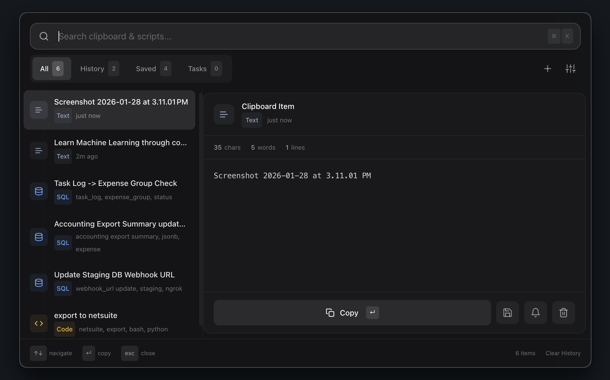

# Recall

A Raycast-like clipboard manager and script vault for developers.



## Features

- **Clipboard History** - Automatically saves clipboard items (configurable limit: 25, 50, 100, or 200)
- **Saved Scripts** - Pin important snippets permanently or with expiry dates (1 hour, 1 day, 7 days, 30 days)
- **Tasks & Reminders** - Set reminders with custom dates/times or recurring intervals
- **Smart Content Detection** - Automatically detects SQL, JSON, URLs, Bash scripts, code, emails, file paths, and more
- **Tags & Organization** - Tag scripts for easy categorization
- **Instant Search** - Fuzzy search across all items (clips, scripts, and tasks)
- **Filter Views** - Filter by All, History (clips), Saved (scripts), or Tasks
- **Preview Pane** - Split-view interface with content preview and metadata
- **Global Shortcut** - Access from anywhere with customizable keyboard shortcut (default: `Cmd+Shift+V`)
- **Customizable Settings** - Adjust font size, history limit, and global shortcut
- **Minimal UI** - Clean, Raycast-inspired interface with glassmorphism design

## Keyboard Shortcuts

### Global
| Shortcut | Action |
|----------|--------|
| `Cmd+Shift+V` | Toggle window (configurable in settings) |

### In App
| Shortcut | Action |
|----------|--------|
| `↑` / `↓` | Navigate items |
| `Enter` | Copy selected item to clipboard |
| `Cmd+N` | Create new script |
| `Cmd+K` | Focus search bar |
| `Cmd+,` | Open settings |
| `Esc` | Close window |

### Item Actions
- **Pin to Saved**: Select a clip and use the pin action to save it as a script
- **Set Reminder**: Add a reminder/task to any item with custom or preset times
- **Delete**: Remove items from history or saved scripts

## Installation

```bash
# Install dependencies
npm install

# Run in development
npm run dev

# Build for production
npm run build

# Export as Mac install dmg
npm run package
```

## How It Works

1. **Clipboard Monitoring** - The app watches your clipboard and saves every copy (up to your configured limit)
2. **Temporary vs Permanent** - Clipboard history is temporary (FIFO), but you can pin items to save them permanently as scripts
3. **Script Management** - Save scripts with titles, types (SQL, Bash, cURL, Text), tags, and optional expiry dates
4. **Reminders & Tasks** - Set one-time or recurring reminders on any item with system notifications
5. **Content Detection** - Automatically detects content types (SQL, JSON, URLs, code, etc.) for better organization
6. **Quick Access** - Press the global shortcut, search or filter, and hit Enter to copy

## Content Types

Recall automatically detects:
- **SQL** - Database queries
- **JSON** - Structured data
- **URLs** - Web links
- **Bash/Shell** - Command-line scripts
- **Code** - Programming code snippets
- **Email** - Email addresses
- **File Paths** - File system paths
- **Text** - Plain text (default)

## Reminders & Tasks

- Set reminders with preset times (5 min, 15 min, 30 min, 1 hour, 2 hours, 4 hours, 12 hours, 24 hours) or custom date/time
- Create recurring reminders (every 5 min, 15 min, 30 min, 1 hour, 2 hours, 4 hours, 12 hours, or daily)
- Receive system notifications when reminders are due
- View overdue tasks with visual indicators
- Mark tasks as complete

## Settings

Customize your experience:
- **Global Shortcut** - Choose from presets or record a custom shortcut
- **History Limit** - Set maximum clipboard items (25, 50, 100, or 200)
- **Display Size** - Adjust font size (Compact, Default, or Large)

## Data Storage

Data is stored locally in:
- **macOS**: `~/Library/Application Support/recall/`
- **Windows**: `%APPDATA%/recall/`
- **Linux**: `~/.config/recall/`

## Tech Stack

- **Electron** - Cross-platform desktop framework
- **React + TypeScript** - Modern UI with type safety
- **Tailwind CSS** - Utility-first styling
- **better-sqlite3** - Local database storage
- **Fuse.js** - Fuzzy search implementation
- **Vite** - Fast build tool and dev server
